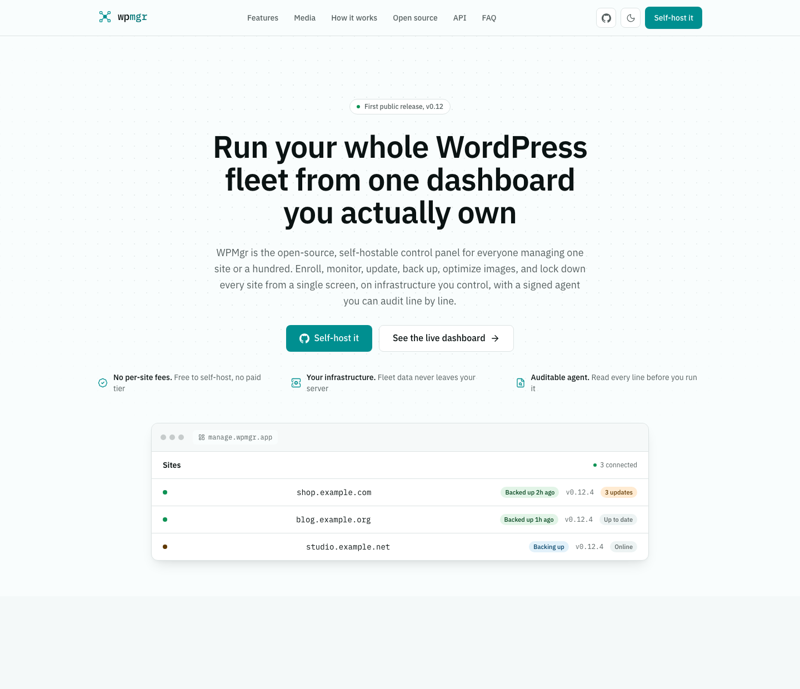

# WPMgr

**Open-source, self-hostable WordPress fleet management.**

WPMgr lets you enroll, monitor, update, back up, and secure a fleet of WordPress sites from one dashboard — all running on infrastructure you control. The control plane is a Go binary with a React dashboard; a lightweight PHP plugin on each managed site handles the work. Everything between the agent and the control plane is Ed25519-signed.

[](https://wpmgr.app)

<p align="center">
  <a href="https://wpmgr.app">Website</a> ·
  <a href="https://manage.wpmgr.app">Live dashboard</a> ·
  <a href="https://wpmgr.app/docs/">API reference</a>
</p>

**v0.28.0** — open-source and production-usable for self-hosters.

---

## Features

### Fleet connection

- **Live enrollment** — Add a site by URL; paste a one-time code into the agent plugin; the dashboard flips from "Awaiting" to "Connected" automatically, no refresh needed.
- **Real-time connection state machine** — Six precise states (`pending_enrollment` → `connected` → `degraded` → `disconnected` → `revoked` → `archived`) replace a vague up/down flag. Every transition is written to auditable, hash-chained history.
- **60 s heartbeat with auto-recovery** — A background sweeper degrades → disconnects silent sites within minutes. A returning agent auto-recovers without operator action.
- **Fleet SSE stream** — One shared Server-Sent Events stream keeps the entire sites list live (status dots, last-seen counters) without polling. Cursor-based replay catches events missed while offline.
- **One-click autologin to wp-admin** — Single-use, short-lived, audited EdDSA tokens; no shared passwords. Deep-links straight to Plugins or Themes, or log in as a specific user.
- **Signed dashboard-to-agent revoke** — Revoke from the dashboard; the agent verifies a signed token on its next heartbeat and self-destructs. A man-in-the-middle on the heartbeat response cannot forge the teardown.
- **Signed last-will on deactivate/uninstall** — Agent disconnects itself on deactivation (3 s best-effort); the timeout sweeper is the safety net if it never arrives.
- **Re-enrollment under a stable identity** — Re-connecting a site keeps the same `site_id`, preserving all backup history, scan runs, and lifecycle generations.
- **Archive / restore soft-delete** — Retire sites from the active view without losing their history; restore them later.
- **Per-site sharing** — Share exactly one site with a collaborator, enforced by both Gin middleware and Postgres RESTRICTIVE RLS, without exposing the rest of the fleet.

### Backups & restore

- **Pure-PHP streaming DB dump** — Server-side cursor (`MYSQLI_USE_RESULT`), `REPEATABLE READ` snapshot, ~1 MiB batched INSERTs. No mysqldump binary, no shell access — works on locked-down managed hosts. Memory use is independent of database size.
- **Pure-PHP streaming file archiver** — ZipArchive streaming (never loads file bodies into memory), rotated at 200 MiB / 55 k entries per part. Splits wp-content into per-component sequences (plugins, themes, uploads, other, WP core) for targeted restore.
- **Incremental archive-delta backups** — Each increment diffs the live file tree against the parent snapshot's `files.list` by size + mtime and packs only changed or new files into standard part archives, with deletions recorded as tombstone manifest sidecars. The database is dumped in full every run.
- **Selective-component backups + exclusion patterns** — Per-site choice of which components to archive (plugins / themes / uploads / wp-content / database / WP core) plus exclude-path, exclude-extension, and max-file-size filters pushed to the agent on every run. Backup content settings are decoupled from the schedule so manual and scheduled runs share one definition.
- **Content-addressed chunking with dedup** — Each artifact is chunked at ~4 MiB, BLAKE3-hashed, and deduplicated across snapshots. Only changed chunks re-upload on the next full backup.
- **Client-side age encryption** — Optional X25519 + ChaCha20-Poly1305 per-chunk encryption to the site's public recipient; the control plane stores only ciphertext and never holds a decryption key.
- **Three backup destinations** — Control-plane-managed bucket, customer-owned S3-compatible bucket (agent never holds the credentials), or a local folder on the WordPress host.
- **SQL inspection at backup time** — A streaming constant-memory scanner produces `sql-inspection.json` (charset, table prefix, per-table row/byte estimates, WordPress detection, `siteurl`/`home`/`db_version`) stored with every snapshot.
- **Environment fingerprint** — `environment.json` captures PHP/MySQL/WordPress versions, plugin/theme slugs, table list, and size at snapshot time.
- **Resumable watchdog-driven state machine** — Phases are checkpointed to a task row; a watchdog re-enters stalled backups up to 6 times. Long backups survive PHP time limits and FPM worker recycling without redoing finished work.
- **Scheduled backups** — Hourly, every-N-hours, daily, weekly, or monthly cadences, run in the site's own WordPress timezone, jittered per site so the fleet doesn't fire simultaneously.
- **Snapshot lock** — Lock a snapshot to exempt it from retention GC regardless of age or keep-last rules; unlock explicitly when no longer needed.
- **Mark-and-sweep retention GC** — Tenant-global reachability walk deletes a chunk only when it is unreachable from every retained snapshot across all sites and predates a fail-closed grace floor. Refcount is observability-only and never consulted for delete decisions.
- **Backup-completion email** — Per-site notification config (always / on-failure / never + recipient list) sends a branded email on backup completion or failure for both manual and scheduled runs.
- **Live SSE progress** — Phase-by-phase progress including chunk and byte counters streams to the dashboard in real time.
- **Point-in-time chain restore with version picker** — Restoring a chain member overlays each generation's parts in order (newest-wins extraction) then applies tombstone deletes, so any snapshot in the chain restores correctly. The restore dialog renders a version picker across all completed chain generations.
- **Component-scoped restore** — Restore the whole site, just the database, just files, or fine-grained components (plugins, themes, uploads, wp-content). Compose with per-path or per-table lists.
- **Atomic file restore** — Extract to a hidden staging directory, move live tree aside to a `.wpmgr-old-files-<id>/` rollback dir, rename staging into place. A crash never leaves a half-merged site.
- **Online DB restore** — Import into `tmp<id>_`-prefixed tables while WordPress stays live; swap each table atomically via `DROP + RENAME` at the end. A failed import leaves the live database untouched.
- **Resumable restore** — Same watchdog pattern as backup: persisted phase state, chunk-level download resume, mid-table URL-rewrite resume.
- **Two-leg disk-free precheck** — Estimates required disk before touching anything; refuses with a GB-denominated message if there is not enough space.
- **Self-preservation guards** — Never clobbers the running agent plugin, keystore, `wp-config.php`, `.htaccess`, or cache drop-ins; copies them forward from the live tree into staging before the swap.
- **Path-traversal & integrity hardening** — Every downloaded chunk is BLAKE3-verified; every zip entry is traversal-checked with a canonical-path containment check against the staging root.
- **Maintenance-mode windowing** — Drops WordPress's `.maintenance` file around the destructive swap; removes it and flushes object cache, OPcache, and rewrite rules on completion.

### Updates

- **Per-site available-updates inventory** — WordPress core, plugin, and theme update lists with current → new versions, active-first sorted.
- **On-demand inventory refresh** — Force re-poll WP update transients via a signed CP→agent command; returns 409 with a clear message when a site is unreachable.
- **Bulk fleet-wide update runs** — Target an explicit set of site IDs or a tag; expands to per-(site, item) tasks.
- **Dry-run preview** — The bulk wizard defaults to `dry_run=true` so the first submit is a safe preview with exact version deltas.
- **Pre-update snapshot + automatic health-check rollback** — The agent snapshots the component before updating; the CP health-probes the site after; a bad update is reverted automatically.
- **WP-CLI-first with PHP upgrader fallback** — Works with or without WP-CLI; preserves active-plugin state on the PHP fallback path.
- **Live SSE progress per run** — Task status transitions stream in real time; a snapshot-on-connect plus a 2 s poll safety net prevent stale "Queued" states.
- **Post-update inventory auto-refresh** — Debounced per-site (30 s window) after every terminal task so the available-updates list self-heals.
- **Argument-injection hardening** — Slugs and versions are validated on both the CP (`validateItems`) and agent (`sanitizeSlug`, `isValidVersion`) against a safe charset; shell metacharacters, `..` traversal, and flag separators are rejected.
- **Per-tenant concurrency isolation** — Sharded River queues with a per-tenant running-task limit; one large fleet update cannot starve other tenants.
- **Update run history** — Auditable trail of who updated what, when, outcome per site/item, with from/to version and timings.

### Monitoring & health

- **Active uptime monitoring** — SSRF-hardened probes classify up/down with a full timing breakdown: DNS, connect, TLS handshake, TTFB, total.
- **Uptime % + latency charts** — Windowed reports over 7 d / 30 d / 90 d; downsampled server-side. Tenant-wide status summary across the whole fleet.
- **TLS certificate tracking** — Expiry, issuer, and subject captured on every HTTPS probe; flags "renew soon" at < 14 days.
- **Pluggable time-series store** — Postgres (default, one row per probe) or ClickHouse (MergeTree, 90-day TTL) selectable at boot.
- **Downtime/recovery alerts** — Transition-only (opens incident on N consecutive failures, closes on recovery). One downtime alert and one recovery alert per outage — never a flood.
- **Alert channels** — Email (SMTP) and HMAC-SHA256-signed webhook. Both uptime and high-severity security events share one channel config.
- **Full WordPress Site Health collection** — Ships the complete `WP_Debug_Data::debug_data()` dump (all native sections plus third-party plugin contributions from Yoast, WooCommerce, ACF, etc.) centrally.
- **14-category extended diagnostics with fault isolation** — Identity, PHP, MySQL, filesystem, HTTP loopback, cron, themes, plugins, users, security constants, HTTPS, mail, performance, hosting — each in an isolated wrapper so one failing probe doesn't blank the screen.
- **Leapfrog diagnostic signals** — Max-overdue WP-Cron age, OPcache hit-rate/memory, `site_as_of_hash` fingerprint (changes when any managed component moves), agent-side managed-host detection (Pressable, GridPane, WP Engine, Atomic/WPCOM, Kinsta, Flywheel, RunCloud, Cloudways), and control-plane offline egress-IP inference of the underlying cloud/IaaS provider (DigitalOcean, Hetzner, AWS, Google Cloud, Azure, Vultr, OVH) via embedded DB-IP ASN lookup (no API key; no IP leaves the operator). IP data by DB-IP.com.
- **JIT directory sizes** — Fresh or cached (< 6 h), computed via `du` or PHP fallback, annotated with method + computed-at timestamp. Never blank like the native Site Health screen.
- **Privacy redaction** — Agent-side recursive walker redacts `admin_email`, `*_password`, `*_secret`, `*_token`, API keys, and auth salts before the diagnostics blob leaves the site.
- **On-demand diagnostics refresh** — One click re-collects all categories and lands the data before the response returns.
- **PHP error monitoring** — Error + shutdown handlers (including a must-use plugin that arms before other plugins boot, catching bootstrap-time fatals). Deduped by `md5(code:file:line:message)` with occurrence counters and gzip-compressed backtraces. Near-immediate ship on fatal.
- **Per-site error config** — Level bitmask + fingerprint silence list pushed to the agent. Silencing a fingerprint deletes its existing rows immediately. Fatals always captured regardless of mask.
- **Hash-chained activity log** — ~30 WordPress events (posts, comments, users, auth + failed logins, plugins, themes, core updates, terms, security-relevant options, WooCommerce order/product events) written as a SHA-256 chain. Control plane re-verifies byte-for-byte on ingest and on demand.
- **Filtered, paginated activity feed** — Newest-first cursor pagination with filters by event type, object type, actor, severity, and time range. Per-row `chain_valid` flag; a `/verify` endpoint reports the first broken link if any row was altered.

### Security

- **Core file-integrity scan** — Resumable, cursor-paginated MD5 walk diffed against the official WordPress.org Checksums API for the site's exact version + locale.
- **Three finding types** — `core_modified` (high), `core_missing` (medium), `core_unknown_injected` (high). Only flags within core paths; operator-mutated files (`wp-content/`, `wp-config.php`, cache drop-ins, etc.) are allow-listed to minimize false positives.
- **Checksum caching** — 30-day positive TTL (releases are immutable), 6-hour negative TTL, transparent `en_US` locale fallback. Repeated fleet scans never hammer the public wp.org API.
- **Finding triage** — Mark findings ignored (audited). Fetch raw file contents in-dashboard (server-gated: only stored findings, access audited) without SSH.
- **Brute-force login protection** — Three escalating tiers per sliding window: captcha gate → per-IP temporary block → global site-wide block. Known-good bypass (recent success from same IP) avoids locking out legitimate admins.
- **Three protection modes** — `disabled` (inert by default), `audit` (records/logs, never blocks), `protect` (enforces 403). Malformed config push falls back to safe defaults.
- **Early-boot WAF IP firewall** — Must-use plugin (loads before any other plugin) checks deny CIDRs at the very start of WordPress boot; allow CIDRs and private/loopback IPs always win first. DB error fails open.
- **Operator-controlled CIDR allow/deny** — IPv4 + IPv6, validated on the CP (`net.ParseCIDR`), binary `inet_pton` bitmask comparison on the agent. Spoof-resistant configurable real-IP header.
- **Lockout safety rail** — Enabling protect mode with an empty allow-list auto-adds the operator's own IP as a `/32` or `/128`.
- **Manual IP unblock** — Deletes the IP's failure rows, resetting its sliding-window counter while preserving success rows.
- **Login-page whitelabeling** — Per-site logo URL, logo link, and message. URLs scheme-validated (http/https only); message run through a narrow `wp_kses` allowlist (no `script`/`style`/`iframe`/`on*`). Safe to inject CP-controlled content into `wp-login.php`.
- **Hashed, role-scoped API keys** — `wpmgr_<prefix>_<secret>` format; only sha256 hash + prefix stored; secret shown once at creation; constant-time compare (`crypto/subtle`); per-key role flows through the full RBAC matrix.
- **Per-site access enforcement** — Every scan, login-protection, login-brand, and unblock route requires `RequireSiteAccess`. Routes resolved by global ID (get-run, ignore-finding, fetch-file) re-resolve the object's real site and call `CanAccessSite` before reading or mutating.

### Performance

- **Zero-DB page cache fast path** — An `advanced-cache.php` drop-in serves anonymous pages as pre-gzipped HTML straight from disk (`wp-content/cache/wpmgr`) before WordPress, plugins, or the theme load. A cache HIT makes zero DB or plugin calls and streams the `.html.gz` with a 304 Not-Modified short-circuit.
- **Variant-aware cache key** — Pages cache separately per device (mobile UA), per logged-in role, per operator-included cookie, and per cache-varying query string (marketing params stripped). The drop-in's key algorithm is byte-identical to the PHP writer.
- **Safe cacheability gates** — Never caches non-200, admin/login/AJAX/feed/sitemap paths, password-protected posts, or any request carrying a bypass cookie (WooCommerce/EDD cart + session, logged-in, comment-author). WooCommerce cart/checkout/account pages are excluded outright.
- **Automatic server fast-path install** — Enabling the cache writes the `WP_CACHE` define, installs the drop-in, and adds an Apache `.htaccess` block that serves `.gz` without PHP. nginx gets a copy-paste `try_files` snippet; built-in handling for OpenLiteSpeed and WP Engine Atomic.
- **Purge: all, per-URL, and auto on content change** — Manual purge of the whole cache or a single URL's variants, plus automatic invalidation on post/comment/product/template change that purges and re-warms the exact affected URL set (permalink, home, archives, every assigned + ancestor term).
- **Host / edge-cache purge integrations** — Every purge fires `wpmgr_purge_*:before/:after` actions so managed-host and CDN edge caches (Varnish, Kinsta, WP Engine, etc.) clear in lockstep.
- **Full-site preload warmer** — Warms every cacheable URL (home, all public post types including WooCommerce products, every non-empty term archive, author archives) across desktop and mobile UAs, via a custom self-dispatching MySQL queue with atomic claim/lock, retry/backoff, and same-host SSRF filtering.
- **Operator-tunable preload throttle** — Concurrency (1-4 workers), inter-request delay (0-10000 ms), batch size (1-500), and a per-core load-average ceiling above which a pass defers — clamped on both control plane and agent.
- **Remove Unused CSS — own engine, no headless browser** — The agent POSTs page HTML + CSS to the control plane, which computes used-CSS with its own engine (no third-party service), caches it in object storage, and dedups across pages of the same structure hash. The agent inlines the used-CSS and defers the originals. Any failure or cache-miss serves full CSS unchanged — rendering is never blocked.
- **RUCSS safelist** — Built-in safelist of slider/lightbox/runtime-state classes plus operator-defined selectors are force-kept so JS-driven widgets survive the purge.
- **Post-compute cache reheat** — When the async RUCSS worker finishes, the control plane purges the URL and re-fetches it so the next render is a HIT with optimized HTML already cached.
- **CSS/JS minification** — Local same-site stylesheets and scripts are minified, content-addressed into a local asset cache, and tag URLs rewritten. Already-minified and external files are skipped.
- **JavaScript delay (defer / interaction / idle)** — Defers first-party JS via the `defer` attribute, or rewrites scripts to `data-src` and runs them only on first interaction or `requestIdleCallback`. Structural scripts (ld+json, speculation rules) are never delayed.
- **Font optimization** — `font-display:swap` injected into `@font-face` + Google Fonts links, optional self-hosting of Google Fonts stylesheets + woff2 files, and heuristic `rel=preload` for the first critical fonts.
- **Third-party asset self-hosting** — Downloads cross-origin CSS/JS to the local asset cache and rewrites tags to same-origin. Best-effort: failure leaves the external URL in place.
- **Image markup optimization (CLS + lazy-load)** — Fills missing `width`/`height` from `getimagesize()` or the filename WxH suffix to prevent layout shift. Adds `loading=lazy` + `decoding=async` to below-the-fold images while keeping the first two eager; existing srcset preserved.
- **YouTube facade + Gravatar self-host** — Replaces YouTube iframes with a click-to-load thumbnail facade (no YouTube JS until clicked) and downloads/self-hosts Gravatars to the local asset cache.
- **Speculation Rules prefetch** — Injects a `<script type=speculationrules>` block that prefetches same-origin links (eagerness moderate) while excluding wp-admin/login, cart/checkout/logout, query-string, and nofollow URLs for near-instant navigations.
- **CDN URL rewrite with encrypted credentials** — Rewrites same-site static-asset URLs to a configured CDN host (all / css-js-font / image groups), runs last so it catches minified + self-hosted URLs, and purges the CDN edge (Cloudflare/Bunny/KeyCDN) on purge using age-encrypted credentials the control plane decrypts only in-process.
- **WordPress bloat removal** — Per-toggle de-bloat (block-library CSS, dashicons, emojis, jquery-migrate, XML-RPC, RSS feeds, oEmbeds, Heartbeat throttling, post-revision cap).
- **Optimize-on-MISS, cache the optimized bytes** — The full optimization pipeline runs inside the cache-writer's MISS path before gzip + write. Every transform is config-gated, wrapped so a failure degrades to a no-op, and skipped for logged-in/personalized responses.
- **Cache hit-ratio history** — The drop-in tallies HIT/MISS to per-hour counter files with zero DB work on a cache hit; the heartbeat drains completed buckets to the control plane, which appends to a Postgres time-series (120-day GC).
- **Hit-ratio trend chart (7/30/90-day)** — Dashboard renders a cache hit-percentage trend with a 7/30/90-day window toggle and an average-ratio badge.
- **Live cache telemetry + verify card** — Agent reports cached-page count, cache size, last purge, and live preload progress over SSE, plus the real install state (web server, drop-in present, `WP_CACHE` define, `.htaccess` managed) so the verify card reflects on-host truth.
- **Page-cache conflict + multi-currency/i18n detection** — Detects other active cache/optimization plugins (reported to the dashboard, never deactivated) and auto-derives the cache-varying cookies/queries that multi-language and multi-currency plugins need so language/currency variants cache separately.
- **Portfolio bulk actions + presets** — Purge the cache across many sites at once, or apply a safe / balanced / aggressive optimization preset to a whole group in one run (each preset spreads a small toggle set without clobbering per-site lists).
- **Page-source footprint marker** — Every cached response carries an HTML-comment footprint (with timestamp, and an `(optimized)` suffix when transformed) so operators can confirm via view-source that WPMgr wrote and optimized the page.

### Media

- **Dedicated cloud encoder** — Separate `media-encoder` container decodes from magic bytes (never trusted MIME) and re-encodes to AVIF (q50/speed8), WebP (q80), or re-optimized original. Animated GIFs → animated WebP.
- **Optional, opt-in** — `docker compose --profile media up`; zero weight or native-library CVE surface on the core API for operators who don't use it.
- **Per-image optimize and full reversible restore** — Originals archived on-site (`.wpmgr-original.*` rename); restore reverts every variant. A separate admin-gated delete-originals reclaims disk.
- **No image bytes on the control plane** — Source and optimized bytes move agent-to-storage and encoder-to-storage via presigned URLs only. CP stores metadata rows only.
- **`.htaccess` Accept-header fallback** — Serves the modern format only when the browser's `Accept` header advertises support; legacy twin is served otherwise. `Vary: Accept` for CDN correctness. nginx map equivalent emitted for non-Apache hosts.
- **Auto-optimize on upload** — Per-site opt-in hooks `wp_generate_attachment_metadata`, debounces (~25 s) batch pushes to the CP, and runs the existing optimize pipeline. Four stacked guards prevent self-optimization loops.
- **Library sync + savings metrics** — Total assets, optimized/pending/failed/unsupported counts, total bytes saved across all variants including thumbnails.
- **Serialization-safe DB URL rewrite** — Rewrites old-to-new media URLs across `post_content` and postmeta in a way safe for PHP-serialized data; recorded for reversible restore.
- **Resilient per-variant encoding** — Per-variant failures never fail siblings; 50 MB / 100 megapixel source limits; 60 s per-encode timeout; size + magic-byte verification of downloaded outputs before write.
- **Unused image library scan** — Walks the entire attachment library and classifies every image as in-use or orphaned by building an exhaustive cross-content reference index. No image is flagged unused unless it appears nowhere.
- **"Where is this image used" attribution** — For every referenced image, surfaces each in-use location: post/page content, excerpts, revisions, featured images, gallery/block IDs, page-builder data (Elementor, Beaver, Bricks, Divi, WPBakery, Oxygen, Breakdance, ACF), SEO/OpenGraph meta (Yoast, Rank Math, SEOPress), theme mods, widgets, nav menus, term meta, and user/avatar meta — with a deep-link to edit the referencing object.
- **Conservative "ambiguous = in use" design** — Casts the widest net (revisions, builder JSON, serialized arrays, sub-size derivation, protocol-agnostic URL matching) and aborts the whole scan if the uploads directory is unresolvable rather than risk a false orphan.
- **Reversible server-backed quarantine** — Instead of deleting, isolate moves an image's original plus every generated sub-size (and optimizer-produced variants) into a web-blocked `wp-content/wpmgr-quarantine/` store with a JSON manifest. The attachment post stays in the library so the action is fully reversible.
- **One-click restore from quarantine** — Any isolated set can be moved back to its exact original upload paths from the manifest, with path-containment checks ensuring files only ever land back inside the uploads directory.
- **Confirmation-gated permanent delete** — Permanent removal of quarantined files plus their attachment posts requires an explicit `DELETE` confirmation token, enforced independently at both the control plane and the agent (constant-time compare).
- **Role-gated, audited cleaner endpoints** — Scan and quarantine-list are viewer-level reads; isolate/restore/delete require operator-level write permission. Every action is recorded to the audit log and emitted over the live site-event bus.

### Site tools

- **Database Cleaner (scan / preview / clean)** — Read-only scan estimates then bounded, batched cleanup across 14 categories: post revisions, auto-drafts, trashed posts, spam/trashed comments, expired transients, orphaned post/comment meta, orphaned term relationships, oEmbed cache, duplicate postmeta, Action Scheduler completed/failed, and OPTIMIZE TABLE on non-InnoDB tables. Per-category `{rows_deleted, bytes_freed, state}` results stream back over signed progress pushes.
- **Database Cleaner safety** — Each task deletes only the rows it targets; SELECT→DELETE batching in 2000-row chunks with a hard iteration cap, OPTIMIZE TABLE on a 12 h cooldown, and operator-level permission gate. WP core options/cron/tables and installed-plugin-attributable items are skipped.
- **Per-table inventory + maintenance actions** — Every table listed with row count, size, storage engine, overhead, and a "Belongs to" label (WordPress core / active plugin or theme / orphan). Per-table actions: optimize, repair, analyze, convert to InnoDB, empty, delete — each gated by a typed confirmation. Orphaned options and cron events classified by corpus confidence level (exact / prefix / heuristic / unknown).
- **Database Snapshots** — One-click local DB snapshot before a risky change and one-click revert. Dumps to gzipped SQL under `wp-content/wpmgr-snapshots/db/` (web-hardened, never uploaded), with create / list / revert / delete actions and a configurable retention cap (default 5, hard max 20, oldest pruned first).
- **Snapshot revert safety** — Revert is a destructive whole-DB overwrite gated behind an exact `REVERT` confirmation token (constant-time compare). Before importing, auto-captures a pre-revert safety snapshot, then replays the dump into `tmp`-prefixed tables and atomically swaps each over the live table so WordPress stays readable throughout. A failed import leaves the live DB untouched.
- **Search & Replace** — Operator-driven literal find-and-replace across the whole database (or a chosen table allowlist) for URL/domain migrations and string fixes. Mandatory dry-run preview returns tables-scanned / rows-matched counts before any write, then reports rows-changed on apply.
- **Search & Replace safety** — Serialization-safe walker (PHP-serialized blobs are unserialized, rewritten, and re-serialized so `s:NN:` length prefixes are recomputed — never a naive `str_replace`). Minimum 3-char search guard; community migration table denylist; binary/blob columns and `posts.guid` always skipped; all values mysqli-escaped; an advisory `X-Backup-Warning` header fires on a live run with no recent backup.

### Team & access

- **Multi-tenant organizations** — Each resource scoped to an org. Isolation enforced by Postgres Row-Level Security (`app.tenant_id` GUC) with the app role `NOSUPERUSER NOBYPASSRLS`.
- **Four-role RBAC** — `owner > admin > operator > viewer` with a discrete permission matrix. Privilege ceiling prevents granting a role higher than your own.
- **Per-site collaborator sharing** — Outside users (no org membership) scoped to one site, enforced by both Gin middleware and RESTRICTIVE RLS. Blocked from all org-level actions.
- **Tokenized invitations** — Single-use, 7-day-expiry SHA-256-hashed tokens bound to the invited email. Existing accounts must re-authenticate; a leaked link alone cannot log anyone in.
- **Email/password auth with first-run bootstrap** — argon2id hashing; the first signup bootstraps the owner account as verified and active. After that, anyone can self-register — new accounts are created pending and gain access only after clicking the emailed verification link. Login responses never reveal whether an email exists.
- **Self-serve password reset** — Public forgot-password + reset endpoints issue a 30-minute single-use SHA-256-hashed token. Both endpoints are enumeration-safe (always-200, timing-equalized).
- **Change-password with session invalidation** — Verifies the current password then stamps `password_changed_at`, which logs out all other active sessions on their next request while keeping the acting session alive.
- **UI-configured per-instance SMTP** — Owners configure the instance SMTP relay (host/port/TLS/credentials/From) in Settings. The password is age-encrypted at rest, masked on read. A test-send button confirms delivery before saving.
- **OIDC / SSO** — OpenID Connect relying party with PKCE, state, and nonce. Account linking only when the IdP asserts the email is verified. Ships with a Dex container so SSO works locally.
- **Superadmin console** — Instance-level cross-tenant admin area (`/api/v1/admin`) gated by `is_superadmin`, granted only via the `WPMGR_SUPERADMIN_EMAILS` env allowlist and boot seeder — never API-settable. Lists/searches users cross-tenant, disables/deletes users with orphaned-org cleanup, resends verification, and shows instance stats. Intended for operators running multi-tenant self-hosted instances.
- **Tamper-evident audit log** — SHA-256 hash-chained, append-only (DB role denied `UPDATE`/`DELETE`). Covers logins, member/role changes, API-key changes, site lifecycle, sharing, autologin, media consent, updates. `/audit/verify` reports the first broken link.
- **API keys** — Role-scoped, revocable, audited. Carries the same RBAC permission matrix as a user session.

---

## Architecture

```
apps/api    — Go 1.26 + Gin control plane (modular monolith)
apps/web    — React 19 + TypeScript + Vite + TanStack dashboard
apps/agent  — PHP 8.1+ WordPress agent plugin (MIT)
```

**Data:** Postgres (primary + RLS) · Redis (sessions, cache, dedup) · S3-compatible object storage (backups, media) · on-disk page cache (`wp-content/cache/wpmgr`, pre-gzipped `.html.gz`) · ClickHouse (optional, uptime time-series)

**Agent ↔ CP auth:** Ed25519 signed requests (canonical `METHOD\nPATH\nTIMESTAMP\nNONCE\nsha256(body)`) with per-request nonce + timestamp for anti-replay. CP→agent commands are short-lived Ed25519-signed JWTs scoped to one site and one operation.

See [docs/architecture.md](./docs/architecture.md) for a full system diagram.

---

## Quickstart (self-host)

The bundled compose brings up the full stack — control plane, dashboard, Postgres, Redis, and object storage — building the API and dashboard from source:

```bash
cp .env.example .env
# Edit .env — at minimum set WPMGR_SESSION_SECRET, WPMGR_DB_PASSWORD, WPMGR_S3_SECRET_KEY
docker compose -f infra/docker-compose.yml up -d
curl localhost:8081/healthz   # {"status":"ok"}   (default WPMGR_API_PORT=8081)
```

Open `http://localhost:8088` in your browser (the default `WPMGR_WEB_PORT`) — the first signup creates the owner account. After that, anyone can self-register and gains access only after verifying their email.

Include the optional media encoder with the `media` profile:

```bash
docker compose -f infra/docker-compose.yml --profile media up -d
```

### Prebuilt container images

The `v0.28.0` control plane, dashboard, and (optional) media encoder are published on GitHub Container Registry — wire them into your own compose, Kubernetes, or Swarm for production:

```bash
docker pull ghcr.io/mosamlife/wpmgr-api:v0.28.0
docker pull ghcr.io/mosamlife/wpmgr-web:v0.28.0
docker pull ghcr.io/mosamlife/wpmgr-media-encoder:v0.28.0   # optional
```

Or bring up the whole stack from the published images (no local build) with the
pull-only Compose overlay:

```bash
export WPMGR_VERSION=v0.28.0   # omit to track :latest
docker compose -f infra/docker-compose.yml -f infra/docker-compose.prod.yml up -d
```

Images are `linux/amd64`. (arm64 multi-arch is a near-term follow-up.)

Full install guide, env reference, and production hardening: [docs/install.md](./docs/install.md).

---

## Install the Agent

1. Download `wpmgr-agent.zip` from the [GitHub Releases page](https://github.com/mosamlife/wpmgr/releases).
2. In WordPress: **Plugins → Add New → Upload Plugin** → choose the zip → **Install Now → Activate**.
3. Open the top-level **WPMgr** admin menu, set the **Control-plane URL** field and click **Save URL**, then paste the dashboard's **Pairing code** into the **Enroll** form and click **Enroll**.

The agent requires PHP 8.1+ and WordPress 6.0+. It self-updates through the control plane's signed update channel.

See [docs/agent.md](./docs/agent.md) for WP-CLI install and configuration options.

---

## Roadmap

The following are accepted architectural decisions with no implementation yet:

- **Fleet-wide backup browser** — Browse and filter snapshots across all sites from one view (route placeholder present, not built).
- **Backup download** — No presigned-download endpoint or web UI; restore is the current recovery path.
- **Scheduled update runs** — `scheduled_at` is stored and accepted; no deferred dispatcher yet (tasks enqueue immediately on create).
- **CAPTCHA challenge on login block** — Login protection currently serves a static 403; no challenge/solve flow built.
- **Plugin/theme content malware scanning** — The scan engine covers WordPress core checksums only; no signature or heuristic detection for wp-content files yet.
- **Automatic restore rollback UI** — The `.wpmgr-old-files-<id>/` rollback directory is preserved; no operator-initiated rollback endpoint exposed.
- **Helm chart / Terraform provider** — Stubs exist under `infra/`; not implemented.
- **AI features** — `apps/api/internal/ai/` contains only a `.gitkeep` placeholder.

---

## Repository layout

```
apps/
  api/      Go control plane
  web/      React dashboard
  agent/    WordPress agent plugin
packages/
  openapi-client/   generated TypeScript API client
infra/
  docker-compose.yml
  Dockerfile.api · Dockerfile.web · Dockerfile.media-encoder
  postgres/ · seaweedfs/ · nginx/ · dex/ · grafana/
docs/
  install.md · agent.md · architecture.md · contributing.md · security.md · api.md · adr/
```

---

## Development

```bash
cp .env.example .env
docker compose -f infra/docker-compose.yml up -d   # data plane

# API
cd apps/api && go run ./cmd/wpmgr

# Web
cd apps/web && pnpm dev

# Regenerate OpenAPI client after schema changes
go generate ./internal/api/gen/...
pnpm -C packages/openapi-client generate
```

See [docs/contributing.md](./docs/contributing.md) for the full dev setup, PR checklist, and ADR process.

---

## License

| Component | License |
|---|---|
| Control plane + dashboard (`apps/api`, `apps/web`) | [AGPL-3.0-only](./LICENSE) |
| WordPress agent plugin (`apps/agent`) | [MIT](./LICENSE-AGENT) |

---

## Links

- [Install (self-host)](./docs/install.md)
- [WordPress agent](./docs/agent.md)
- [Architecture](./docs/architecture.md)
- [API reference](./docs/api.md)
- [Contributing](./docs/contributing.md)
- [Security policy](./docs/security.md)
- [Architecture decisions](./docs/adr/)
- [GitHub Releases](https://github.com/mosamlife/wpmgr/releases)
