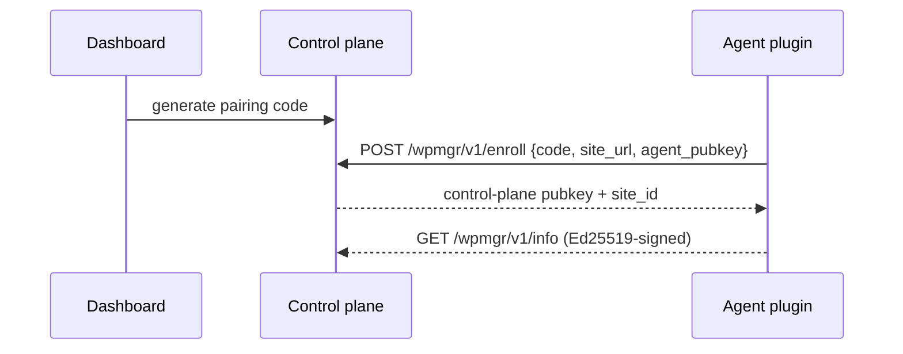

# WordPress agent

The WPMgr agent is an MIT-licensed WordPress plugin (`apps/agent`, PHP 8.0+)
installed on each managed site. It exposes a REST namespace `wpmgr/v1` and talks
to the control plane over **Ed25519-signed** requests. No third-party telemetry.

> **V0 skeleton.** The plugin installs, activates, and serves the signed
> `/wpmgr/v1/info` endpoint. The dashboard pairing exchange is the intended
> setup flow, implemented in Phase 5 / milestone M2 (marked below).

## Install

**Option A — upload the zip (WordPress admin):**

1. Build or download `wpmgr-agent.zip` (see [Build the zip](#build-the-zip)).
2. WP Admin → Plugins → Add New → Upload Plugin → choose the zip → Install Now.
3. Click **Activate**.

**Option B — drop into `wp-content/plugins`:**

```bash
unzip wpmgr-agent.zip -d /path/to/wp-content/plugins/
# then activate in WP Admin → Plugins, or:
wp plugin activate wpmgr-agent
```

## Pair with the dashboard

> **Intended setup flow — Phase 5 / M2.** Pairing is the designed enrollment
> path; for the V0 skeleton, install + activate and confirm the signed
> `/wpmgr/v1/info` endpoint responds.

1. In the dashboard, click **Add site** → copy the one-time **pairing code**.
2. In WP Admin → **WPMgr** settings, paste the pairing code and your control
   plane URL, then **Connect**.
3. The plugin generates its Ed25519 keypair, posts its public key + site URL to
   the control plane, and the control plane verifies the code and stores it.
4. The site shows **online** in the dashboard.



## Heartbeat & connection lifecycle

> **Phase 5.7 / agent `0.10.1-revoke-verify`.** The lifecycle behaviours below
> ship in agent version `0.10.1`. Full guide:
> [features/site-lifecycle.md](./features/site-lifecycle.md). Design:
> [ADR-039](./adr/ADR-039-heartbeat-cadence-timeouts.md),
> [ADR-040](./adr/ADR-040-agent-last-will-disconnect.md).

The agent posts a **60-second** signed heartbeat (WP-Cron `wpmgr_agent_heartbeat`
on the `wpmgr_60sec` schedule) to `POST /agent/v1/heartbeat`. The control plane
uses heartbeat freshness to drive the connection state: fresh ≤180s →
`connected`; ≥180s → `degraded`; ≥360s → `disconnected`. On a successful enroll
the agent also fires **one heartbeat immediately** so the dashboard flips to
`connected` within ~1s instead of waiting for the first tick.

> **No-traffic / no-cron caveat.** WP-Cron only fires on site traffic. A
> low-traffic site can go minutes between page loads, so it may read `degraded`
> or `disconnected` despite being healthy. Drive wp-cron from the system crontab
> instead:
>
> ```cron
> * * * * * curl -s 'https://your-site.example/wp-cron.php?doing_wp_cron' >/dev/null 2>&1
> ```
>
> (Optionally also `define('DISABLE_WP_CRON', true);` in `wp-config.php` so the
> heartbeat is driven *only* by the system cron above.) This is a documented,
> accepted limitation of traffic-gated WP-Cron.

**Last-will on deactivate / uninstall.** When the plugin is deactivated or
uninstalled, WordPress fires the corresponding hook and the agent posts a
**signed** last-will `POST /agent/v1/disconnect` (`reason: deactivated |
uninstalled`). It is **best-effort with a 3-second timeout** — a failure never
blocks deactivation; the control plane's heartbeat-timeout sweeper is the safety
net (≤360s). Deactivate leaves the keys in place (it may be temporary);
uninstall additionally wipes key material and drops the agent's options.

**Signed revoke teardown.** A dashboard-initiated **revoke** is returned to the
agent as a `revoke` instruction on its next heartbeat (≤60s), accompanied by a
**signed revoke token** — a short-lived Ed25519 JWT (`cmd="revoke"`,
`aud=<site_id>`) minted by the control plane's command signer. The agent
**verifies that token** (signature against the stored control-plane public key,
`exp`, `aud == own site_id`, `cmd == "revoke"`, single-use `jti`) **before**
wiping its keys + self-deactivating. It **fails closed**: an absent, forged,
expired, replayed, or wrong-audience token is ignored and no teardown happens —
TLS trust alone cannot force a destructive self-deactivation. See the
[ADR-040 addendum](./adr/ADR-040-agent-last-will-disconnect.md#addendum-2026-05-31---signed-revoke-instruction-phase-6-security-review).

## Security model

- **Ed25519-signed requests** both directions. Each side verifies the other's
  signature against the public key exchanged at enrollment — a compromised
  network can't forge agent or control-plane calls.
- **No telemetry.** The agent only communicates with the control plane URL you
  configure. It phones no third party home.
- **Untrusted by the control plane.** The agent runs on a possibly-compromised
  WordPress host, so the control plane treats all agent-supplied data as
  untrusted and schema-validates it.

Locked crypto: Ed25519 (signing), AES-256-GCM (at-rest secrets), blake3
(integrity), age (backup encryption). Details in [security.md](./security.md).

## Media Optimizer

> **M23 / Phase 7.** Encoding runs off-host on WPMgr's optional `media-encoder`
> service; the agent uploads sources, applies the optimized outputs on disk, and
> installs the Accept-header fallback. User guide:
> [features/media-optimizer.md](./features/media-optimizer.md). Architecture:
> [architecture/media-optimizer.md](./architecture/media-optimizer.md).

**No Imagick/GD required.** The agent does **no** image encoding. It reads source
bytes from disk, presigned-PUTs them to object storage, and later downloads the
optimized variants and writes them back — all encoding happens in the
control-plane `media-encoder` service (`lilliput`). A host without the Imagick or
GD PHP extensions optimizes images perfectly fine; the agent only does file I/O,
the DB URL rewrite, and the `.htaccess` install.

### The `.htaccess` Accept-header block (Apache)

When you optimize **JPEG → AVIF/WebP**, the new file is written next to the
untouched original and the DB references the modern URL. The agent installs an
idempotent block between `# BEGIN WPMgr Media` / `# END WPMgr Media` markers (WP
managed-block convention — writing twice yields exactly one block) that serves
the legacy twin only when the browser did not advertise the modern format **and**
the twin exists on disk:

```apache
# BEGIN WPMgr Media
<IfModule mod_rewrite.c>
	RewriteEngine On

	# AVIF fallback: no AVIF support -> serve png/jpg/jpeg twin if it exists.
	RewriteCond %{HTTP_ACCEPT} !image/avif [NC]
	RewriteCond %{DOCUMENT_ROOT}/$1.png -f
	RewriteRule ^(.+)\.avif$ $1.png [L]
	# (same pair of rules for .jpg and .jpeg)

	# WebP fallback: no WebP support -> serve png/jpg/jpeg twin if it exists.
	RewriteCond %{HTTP_ACCEPT} !image/webp [NC]
	RewriteCond %{DOCUMENT_ROOT}/$1.png -f
	RewriteRule ^(.+)\.webp$ $1.png [L]
	# (same pair of rules for .jpg and .jpeg)
</IfModule>

<IfModule mod_headers.c>
	<FilesMatch "\.(avif|webp)$">
		Header merge Vary Accept
	</FilesMatch>
</IfModule>
# END WPMgr Media
```

The `-f` guard means a missing twin never 404s; `Vary: Accept` stops shared
caches/CDNs from serving an AVIF response to a no-AVIF client (and vice-versa).
The block is prepended so it runs ahead of WP's front-controller rewrites.

### nginx equivalent (manual — the agent never edits nginx config)

nginx has no `.htaccess`. The agent detects nginx via `SERVER_SOFTWARE`, **skips
the file edit**, and surfaces an admin notice with the equivalent snippet to add
to your server block:

```nginx
# WPMgr Media: serve AVIF/WebP when the client advertises support, else the legacy twin.
location ~* ^(?<wpmgr_base>.+)\.(?<wpmgr_ext>avif|webp)$ {
    add_header Vary Accept;
    set $wpmgr_modern "";
    if ($http_accept ~* "image/$wpmgr_ext") { set $wpmgr_modern "A"; }
    if (-f $request_filename) { set $wpmgr_modern "${wpmgr_modern}B"; }
    if ($wpmgr_modern = "AB") { break; }
    # Fall back to a legacy twin if one exists (try jpg, then png).
    try_files $wpmgr_base.jpg $wpmgr_base.png $uri =404;
}
```

### Troubleshooting

**Modern images aren't downgrading on an old browser.** On Apache, confirm the
`# BEGIN WPMgr Media` block is present in the site-root `.htaccess` and that
`mod_rewrite` + `mod_headers` are enabled. The downgrade only fires when the
legacy twin still exists on disk — after **Delete originals** there is no twin,
so old browsers can no longer be served the legacy format. On nginx, confirm you
pasted the snippet above (the agent cannot install it for you).

**"Could not write `.htaccess`" notice.** The site-root directory (or the file)
is not writable by the web user. Fix the permissions or paste the block manually
between the markers — the install is idempotent and will leave a hand-placed
block alone if it matches.

## Build the zip

```bash
make agent-zip
# → release/wpmgr-agent.zip (excludes vendor/, tests/, *.dist)
```

Develop and test the plugin locally:

```bash
cd apps/agent
composer install
composer test     # PHPUnit (+ Brain Monkey), see ADR-021
```

Entrypoint is `wpmgr-agent.php`; classes autoload from `includes/`
(PSR-4 `WPMgr\Agent\`).
