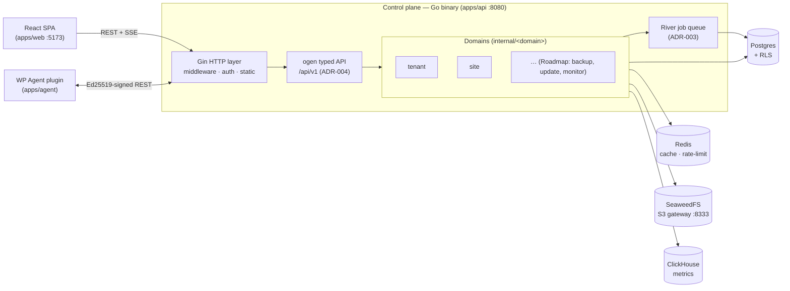
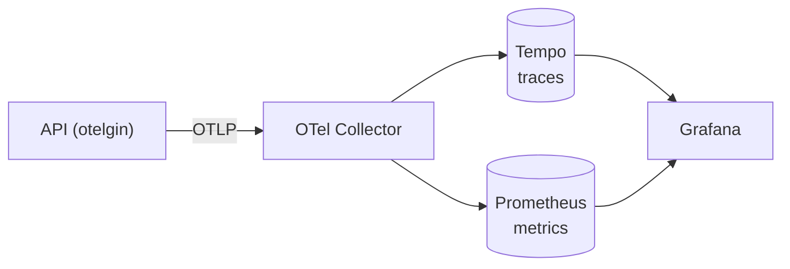
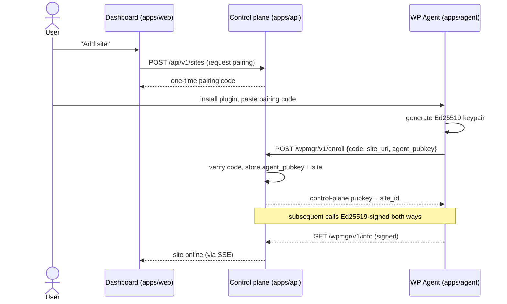
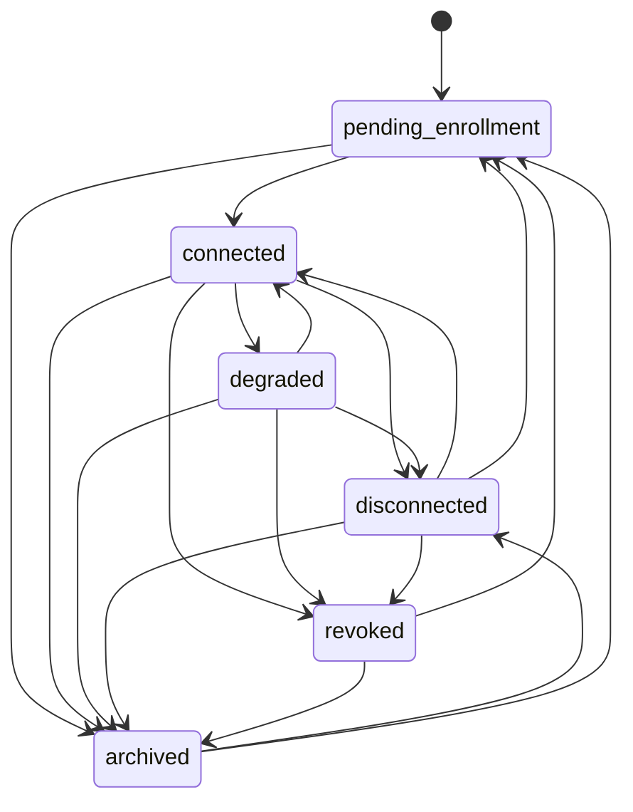

# Architecture

WPMgr is a **modular monolith**: a single Go control-plane binary, a React SPA
dashboard, and a PHP WordPress agent plugin installed on each managed site.

- **Control plane** — Go 1.26 + Gin (`apps/api`, binary `cmd/wpmgr`, listens on
  `:8080`). REST under `/api/v1`, liveness/readiness at `/healthz` + `/readyz`.
- **Dashboard** — React 19 + Vite SPA (`apps/web`, dev port `5173`).
- **Agent** — PHP 8.0+ WordPress plugin (`apps/agent`) talking to the control
  plane over Ed25519-signed REST under namespace `wpmgr/v1`.

## System diagram



Notes:

- **Gin is the outer layer** (middleware, auth, static serving); the
  contract-first **ogen** router owns the typed `/api/v1` endpoints (ADR-004).
  See [api.md](./api.md).
- **SSE** streams live job/site status to the dashboard; WebSocket
  (coder/websocket, ADR-008) is reserved for terminal/log streaming (Roadmap).
- **River** runs background jobs (backups, updates, scans) on Postgres — no
  extra broker (ADR-003). Those jobs are Roadmap; V0 ships the skeleton only.

## Data plane

| Store | Role | Self-host | ADR |
|-------|------|-----------|-----|
| Postgres | System of record; tenant isolation via Row-Level Security | docker compose | ADR-001/002 |
| Redis | Cache, rate-limiting (not the job queue) | docker compose | ADR-003 |
| SeaweedFS | S3-compatible object store for backups/artifacts, S3 gateway on `:8333` | docker compose | ADR-010, risk #1 |
| ClickHouse | Product/time-series metrics (uptime, latency) | docker compose | ADR-011 |

> **SeaweedFS, not MinIO.** The MinIO server went unmaintained in 2026; WPMgr
> uses SeaweedFS (Apache-2.0) as the self-host S3 backend behind a vendor-neutral
> `blobstore` interface using `aws-sdk-go-v2`. See ADR-010 and DECISIONS.md risk
> register item 1.

## Observability

OpenTelemetry SDK + `otelgin` export OTLP to an OTel Collector, which fans out
to **Tempo** (traces) and **Prometheus** (metrics), visualized in **Grafana**
(ADR-011). Self-host enables it with the `observability` compose profile — see
[install.md](./install.md).



## Agent enrollment

> **Intended setup flow — implemented in Phase 5 / milestone M2.** The V0
> skeleton ships the plugin and the signed `/wpmgr/v1/info` endpoint; the
> pairing exchange below is the designed flow, not yet wired end-to-end.

The dashboard generates a one-time pairing code; the user installs the plugin
and pastes the code; the plugin posts its public key + site URL; the control
plane verifies and stores it. All subsequent agent requests are Ed25519-signed.



See [agent.md](./agent.md) for install and the security model, and
[security.md](./security.md) for the full threat model.

## Connection-state machine

Each site carries a `connection_state` — the single source of truth for its
agent connection (Phase 5.7 /
[ADR-041](./adr/ADR-041-reenrollment-identity-connection-state.md)). The
`internal/site` connection service is the **only** writer: every transition
validates its source state against the table below, writes the new state + a
`site_connection_history` row + a hash-chained audit entry in one transaction,
then publishes the SSE event after commit.



`connected ⇄ degraded ⇄ disconnected` are driven by heartbeat freshness;
`revoked` and `archived` are operator actions; `disconnected`/`revoked`/`archived
→ pending_enrollment` is re-enrollment (same `site_id`, bumped
`connection_generation`); `archived → disconnected` is restore. See
[features/site-lifecycle.md](./features/site-lifecycle.md) and
[api/sites.md](./api/sites.md).

### Event bus + heartbeat timeouts

Lifecycle events fan out over a shared bus backed by **Postgres `LISTEN/NOTIFY`**
(ADR-038): a transition persists a `site_events` row, then `NOTIFY`s with ids
only (the 8 KB payload cap means bodies never ride the wire). Every API instance
holds one `LISTEN` connection and re-loads the row to deliver it to its locally
connected SSE subscribers — so an event produced on one Cloud Run instance
reaches an `EventSource` pinned to another. Clients open one tenant-scoped
`GET /api/v1/sites/events` stream, filter by `site_id` in the browser, and
replay missed events via `?since=<ULID>` (~5 min journal retention) on
reconnect.

Heartbeat freshness drives the down transitions (ADR-039): the agent beats every
**60s**; a River sweeper runs every 15s and marks `connected → degraded` after
**180s** missed (3× cadence) and `degraded → disconnected` after **360s**
(6× cadence). The generous 3×/6× margins absorb traffic-gated WP-Cron without
flapping; a heartbeat is the only thing that recovers a site back to
`connected`.

## Repository layout

```
apps/      api (Go) · web (React) · agent (PHP) · tracker (JS) · cli (Go, Roadmap)
packages/  openapi · openapi-client · tsconfig · eslint-config · ui
infra/     docker-compose · Dockerfiles · nginx · grafana · prometheus
           helm (Roadmap V1) · terraform-provider (Roadmap V2)
docs/      install · agent · architecture · api · contributing · security · adr · features
```

Backend domains live under `apps/api/internal/<domain>/` with
`handler/`, `service/`, `repo/`, `model/` subpackages; frontend features under
`apps/web/src/features/<domain>/` mirror them.
