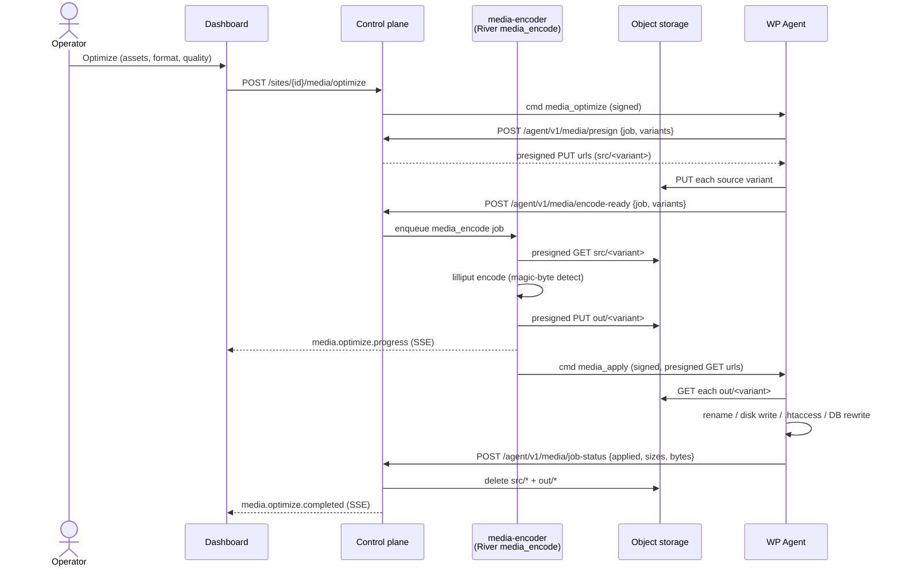

# Media Optimizer — architecture

The pipeline that turns a site's JPEG/PNG library into WebP/AVIF without routing
image bytes through the control plane (CP) and without adding native codec
dependencies to the main API.

Design: [ADR-043](../adr/ADR-043-media-optimizer-architecture.md). Recon:
`analysis/media-optimizer-recon.md`. Transport precedent: ADR-033 (backup
presigned S3); command channel: ADR-031 (CP→agent signed commands).

> **Attribution.** Orchestration patterns (the postmeta blob shape, the
> original-rename trick, the Accept-header `.htaccess` fallback, the
> serialized-safe URL rewriter) are inspired by established image-optimization
> plugin conventions; **no third-party plugin code is included or copied**.
> Encoding runs on WPMgr's own Go control plane using Discord's `lilliput` (MIT).
> See [apps/agent/NOTICE.md](../../apps/agent/NOTICE.md).

## Two binaries, one of them optional

| Service | Image | Encoding | Always on |
|---------|-------|----------|-----------|
| **Main API** (`cmd/wpmgr`) | `distroless/static`, `CGO_ENABLED=0` | none — serves DTOs, owns metadata + RLS | yes |
| **`media-encoder`** (`cmd/media-encoder`) | `distroless/base-nonroot`, **CGO + glibc + lilliput** | runs the `media_encode` River worker | **opt-in** |

`lilliput` is CGO + native codec libraries (libaom/dav1d for AVIF, libwebp,
mozjpeg-class JPEG), so it cannot live in the lean static API image. It is
isolated in a **separate, optional** service behind a compose profile:

```bash
docker compose --profile media up   # bring up the encoder
```

A self-hoster who skips the profile keeps a minimal static API and simply has no
optimize feature. On the hosted deployment the same container is a second Cloud
Run service connecting to the same Postgres + object storage — nothing here is
GCP-specific.

## Transport: presigned S3, no bytes on the CP

Image bytes move **agent ↔ object storage ↔ encoder** over presigned URLs,
exactly like backups. They never ride an API request body and are never
persisted on the CP. The CP stores only metadata rows + audit entries; dashboard
thumbnails load from the **site's own public URLs**.

Per-job temp objects (deleted when the job ends — success, failure, or cancel):

```
media/<tenant>/<site>/<job>/src/<variant>    # agent-uploaded source
media/<tenant>/<site>/<job>/out/<variant>    # encoder-uploaded output
```

The encoder **never** calls a live `GetObject` (it 403s on GCS S3-compat — see
ADR-042); it presigned-GETs the source over plain HTTP and presigned-PUTs the
output. A presigned URL is a bearer credential and is never logged.

## Choreography

The CP drives the agent over the existing **signed-command channel** (CP → agent
Ed25519 JWT, ADR-031) and the agent reports back over **signed-request JSON
callbacks** (agent → CP, the diagnostics/backup model). The `media_encode`
River queue is bounded (small `MaxWorkers`) so a burst of large AVIF encodes
can't OOM the encoder instance.



Per-variant encode failures are recorded with a human reason and do not fail
sibling variants. If **every** variant fails, the encoder finalizes the job as
failed and sweeps the orphaned `src/*` objects itself (no apply phase runs).

## On-site application: the rename trick

Whether the original is archived depends entirely on **same-ext vs different-ext**
(the single most correctness-critical branch):

- **Different extension (JPEG → AVIF/WebP).** No archive. The optimized
  `banner.avif` is written next to the untouched `banner.jpg`; the DB/HTML is
  rewritten to the modern URL. The original is the Accept-header fallback.
- **Same extension (re-compress to `original`).** The original is archived first
  to `banner.wpmgr-original.jpg` (a double-extension marker), then the optimized
  bytes are written in place — the public URL is unchanged.

Restore reverses this: delete the optimized files **first**, then un-rename the
archives, restore `_wp_attachment_metadata` from the verbatim snapshot, and
reverse the URL rewrite. `Rename::archive()` / `Rename::restore()`
(`apps/agent/includes/media/class-rename.php`) own the filesystem half.

### Accept-header `.htaccess` fallback

The agent writes an idempotent block between `# BEGIN WPMgr Media` /
`# END WPMgr Media` markers. For each modern format it serves a legacy twin only
when the client did **not** advertise support (`%{HTTP_ACCEPT} !image/avif`)
**and** the twin exists on disk (`-f` guard, so a missing twin never 404s),
with `Vary: Accept`. On nginx the agent surfaces the equivalent `location`
snippet as an admin notice and edits nothing. See
[agent.md → Media Optimizer](../agent.md#media-optimizer).

### Serialized-safe DB URL rewriter

When the public URL changes (different-ext), every occurrence of the old URL in
`post_content` and `postmeta` must be rewritten. The agent's `DbRewriter`
(`apps/agent/includes/media/class-db-rewriter.php`) is the highest-risk surface
and applies four non-negotiable rules:

1. A trailing **boundary lookahead** `(?=([^0-9A-Za-z]|$))` so `banner.jpg`
   never matches inside `banner.jpg.bak`.
2. **(De)serialize round-trips** for serialized PHP, so `s:NN:` length prefixes
   stay valid (a plain `str_replace` would corrupt them silently).
3. **JSON-aware** decode/encode for page-builder meta (Elementor/Beaver/
   Gutenberg blocks).
4. A **skip-list** of core/optimizer-owned meta keys (`_wp_attached_file`,
   `_wp_attachment_metadata`, the `wpmgr_image_optimization` blob, …).

## Data model

Three tenant-scoped tables (migration `20260531110000_m23_media_optimizer.sql`),
each `ENABLE` + `FORCE ROW LEVEL SECURITY` with a tenant-isolation policy
(`app.tenant_id` GUC) and an `app.agent` worker policy:

| Table | Row | Holds |
|-------|-----|-------|
| `site_media_assets` | one per WP attachment | status, size snapshots, `sizes_optimized` / `sizes_unoptimized`, current format/generation. `UNIQUE(site_id, wp_attachment_id)`. |
| `media_optimization_jobs` | one per attachment per action | ULID id (= the agent's `wpmgr_job_id`), kind, target format/quality, state, byte deltas. |
| `media_variant_results` | one per variant per job | per-size encode result; failures carry a human reason. |

The authoritative restore record lives **on the site** as the
`wpmgr_image_optimization` postmeta blob (the CP holds no image bytes). The CP
rows are a mirror synced via the agent callbacks and drive the dashboard. The
blob's shape and lifecycle are documented in `analysis/media-postmeta-blob.md`.

## Fallback escape hatch

If a lilliput AVIF knob is ever missing, `govips`/libvips (LGPL/MIT) drops into
the **same** `media-encoder` image (Debian runtime + `libvips`) with no change to
the main API. The optimizer stays fully open-source; no managed encode API is
used anywhere.
