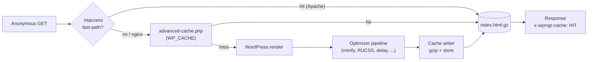
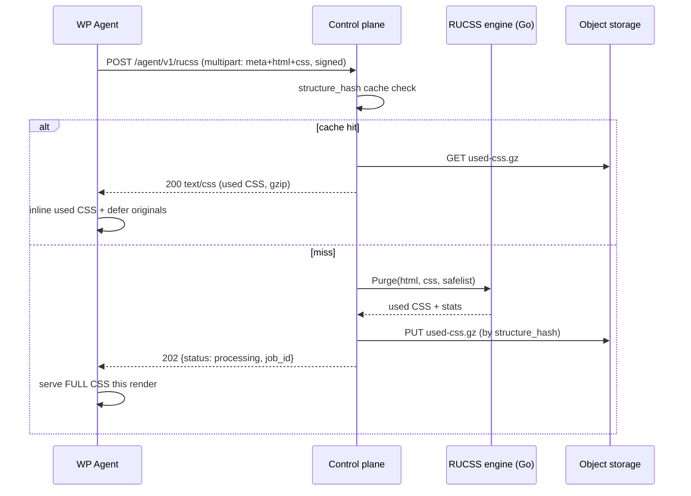

# Performance Suite — architecture

The topology behind page caching, asset optimization, and Remove Unused CSS. Two
correctness rules shape everything: the control plane is a tiny
`CGO_ENABLED=0` `distroless/static` binary that **never executes site PHP**, and
the agent→CP signed channel is JSON-only with a small body cap. So **caching and
optimization run in the agent**, **RUCSS runs on the CP in pure Go**, and large
CSS bytes move via **object storage**, never an API body.

Design: [ADR-046](../adr/ADR-046-performance-suite-architecture.md). Related:
ADR-043 (media optimizer split), ADR-031 (CP→agent signed commands), ADR-038 (SSE
bus), ADR-010 (object storage).

> The caching architecture follows the standard WordPress disk-cache pattern used
> by WP Super Cache and Cache Enabler. Minification uses matthiasmullie/minify.
> RUCSS is an original WPMgr Go engine. All are re-implementations under WPMgr
> naming; no third-party plugin source is copied. See [NOTICE.md](../../NOTICE.md).

## Who does what

| Concern | Where | Why |
|---------|-------|-----|
| Page cache (store + serve) | **agent** | request-time, on-box; the CP never runs PHP |
| Asset optimization (minify, delay, fonts, images, bloat, CDN rewrite, DB clean) | **agent** | standard WP hooks/filters on the rendered HTML |
| RUCSS compute | **control plane (pure Go)** | CPU-spiky parse+match; shared structure-hash cache; no browser on the host |
| Config (source of truth) | **control plane** | `site_perf_config`, one row per site |
| Stats + purge history (mirror) | **control plane** | `site_cache_stats`, `cache_purge_audit` |
| Cached HTML | **agent disk only** | never on the CP |
| Used-CSS bytes | **object storage** | keyed by structure-hash; only metadata in Postgres |

## The drop-in fast-path

Page caching uses the conventional WordPress `WP_CACHE` drop-in mechanism. On
`cache_enable` the agent:

1. sets `define('WP_CACHE', true)` in `wp-config.php` (atomic temp-file + rename),
2. installs `wp-content/advanced-cache.php`, with the live config `var_export`ed
   into the file so it is fully self-contained, and
3. on Apache, splices the managed `.htaccess` block.

WordPress loads `advanced-cache.php` **very early** when `WP_CACHE` is true,
before plugins and the theme. On a hit the drop-in streams the pre-gzipped
`.html.gz` from disk and `exit()`s with zero DB/plugin load. On a miss it
`return false`, WordPress boots normally, and the output-buffer writer stores the
(optimized) HTML for next time. The drop-in's cache-key algorithm is byte-
identical to the PHP-side key builder so a server fast-path and the drop-in never
disagree.

The optimizer runs **inside the writer's miss path**, so the bytes written to
disk are the optimized bytes — the live visitor and every later cache hit get the
same optimized page.

## The `.htaccess` fast-path

The managed block (`# BEGIN WPMgr Cache` / `# END WPMgr Cache`) is prepended
ahead of WordPress's rewrites so the disk fast-path wins. For an anonymous,
query-less, cookie-less GET/HEAD it `RewriteRule`s to the pre-gzipped file before
PHP loads. Host adaptations are baked in:

- **nginx:** ignores `.htaccess`. The agent skips the edit and emits a manual
  `location` snippet; the PHP drop-in still serves every hit.
- **OpenLiteSpeed / LiteSpeed** (`LSWS_EDITION`): the gzip/deflate section is
  stripped so the server's own compression does not double-gzip the `.html.gz`.
- **WP Engine / Atomic** (`Atomic_Persistent_Data`): the drop-in installs under
  the alternate filename `wpmgr-advanced-cache.php` rather than clobbering the
  platform's `advanced-cache.php`.

All install state the agent observes (`dropin_installed`, `wp_cache_constant_set`,
`htaccess_managed`, `server_software`) is reported back into `site_perf_config`
through a dedicated install-state write, so an operator config save never
clobbers agent-reported facts and vice-versa.

## The control-plane RUCSS engine

RUCSS is the marquee decision: Remove-Unused-CSS runs on the CP in pure Go, not in
a browser. The agent POSTs the page HTML + concatenated CSS to
`POST /agent/v1/rucss` (multipart, Ed25519-signed). The CP:

1. parses the HTML (`golang.org/x/net/html`), tokenizes each stylesheet
   (`github.com/tdewolff/parse`), and tests selectors against the static DOM
   (`github.com/andybalholm/cascadia`),
2. always keeps runtime-state pseudos and the semantic at-rules (it cannot prove
   them dead),
3. gzips the used CSS, stores it in object storage keyed by structure-hash, and
   writes the `rucss_results` metadata row,
4. returns the used-CSS **content** (a cache hit, HTTP 200) so the agent inlines
   it without object-storage access, or **HTTP 202** (miss/processing/unavailable)
   so the agent serves full CSS this render and never blocks.

Identical concurrent `(site, structure_hash)` requests collapse to one
computation (singleflight). The structure-hash cache amortizes compute across a
tenant's template families. The engine never panics — it degrades to keep-all
(full CSS) on any malformed input.

## Config + command + stats channels

- **Config push (CP → agent):** the CP is the source of truth. A config save
  pushes the non-secret config to the agent via the signed `perf_config_update`
  command (ADR-031). CDN credentials never travel here — the CP holds the
  ciphertext and performs CDN purges itself.
- **Operations (CP → agent):** `cache_enable`, `cache_disable`, `cache_purge`,
  `cache_preload`, `db_clean`, each a signed command returning an `{ok, detail}`
  envelope.
- **Stats (agent → CP):** the agent reports cheap gauges (page count, on-disk
  bytes, last purge/preload) to `POST /agent/v1/cache/stats-report`; install-state
  to `POST /agent/v1/perf/config-ack`. Both bind tenant + site from the verified
  agent key, never the body.
- **Live updates (CP → browser):** the perf service publishes `cache.*` / `perf.*`
  / `db.*` events on the shared tenant SSE bus (ADR-038), filtered per site.

## Data model

Five tenant-scoped tables (migration `20260603080000_m36_perf_suite.sql`), each
`ENABLE` + `FORCE ROW LEVEL SECURITY` with a `tenant_isolation` policy
(`app.tenant_id` GUC) and an `app.agent` worker policy. Collaborator gating is
done in-app via `authz.RequireSiteAccess(:siteId)` on the routes (the m23
precedent); no `_site_scope` RESTRICTIVE policy.

| Table | Row | Holds |
|-------|-----|-------|
| `site_perf_config` | one per site (PK = `site_id`) | the full performance config the agent mirrors on the request fast-path, plus agent-reported install state. Source of truth. |
| `site_cache_stats` | one per site (PK = `site_id`) | latest agent gauges (page count, bytes, last purge/preload). Overwritten in place; no history. |
| `cache_purge_audit` | one per purge | append-style purge history (kind, initiator, URLs). |
| `rucss_results` | one per `(site, structure_hash)` | used-CSS metadata + reduction stats. The bytes live in object storage (`used_css_s3_key`); `UNIQUE(site_id, structure_hash)`. |
| `rucss_jobs` | one per compute (ULID) | `queued → running → done \| failed` lifecycle linking the result. |

No CSS or image bytes are stored in Postgres. The used CSS moves via object
storage; these tables hold config, metadata, and stats only.

## Why this split holds

- The control plane stays a lean static binary: no browser, no PHP, no cached
  HTML, no CSS/image bytes on the CP.
- Page caching uses the WP mechanism every host understands; degradation is
  non-blocking everywhere (a missing used-CSS result means full CSS, never a
  broken page).
- RUCSS is fully open-source and self-hostable — pure Go, no headless Chrome, no
  SaaS — and the structure-hash cache amortizes compute across a tenant's pages.
