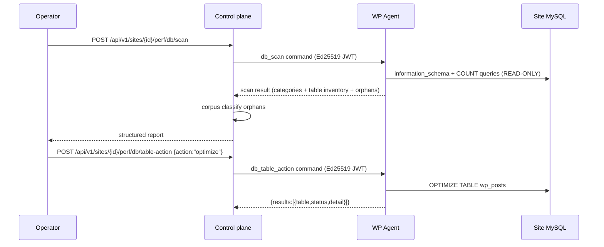

# Database Cleaner

Inspect, clean, and manage a WordPress site's MySQL database from the WPMgr
dashboard. The Database Cleaner is read-safe by default: every action begins
with a non-destructive scan. Destructive operations are gated behind explicit
operator confirmation, a live re-verify step, and a corpus-based safety model
that refuses to delete anything it cannot positively attribute to an uninstalled
plugin.

Architecture: [architecture/perf-suite.md](../architecture/perf-suite.md).
API: [api/perf.md](../api/perf.md#database-cleaner).

---

## How it works

**Agent executes SQL. Control plane orchestrates.**

The control plane (CP) sends signed commands to the agent plugin installed on
each WordPress site. The agent runs the SQL against the site's own MySQL
database and reports results back. The CP never touches the site's database
directly. All reads and writes go through the signed command channel.



---

## Scan: what gets collected

Trigger a scan (operator+):

```bash
curl -X POST https://manage.wpmgr.app/api/v1/sites/$SITE_ID/perf/db/scan \
  -H "Authorization: Bearer $TOKEN"
```

The scan is **read-only**: no deletes, no `OPTIMIZE TABLE`. It uses
`information_schema` metadata and bounded `COUNT(*)` queries; total runtime on
any realistic site is under 5 seconds.

### 14 cleanup categories

| Category | What it counts |
|----------|---------------|
| `revisions` | `wp_posts` rows with `post_type = 'revision'` |
| `auto_drafts` | posts with `post_status = 'auto-draft'` |
| `trashed_posts` | posts with `post_status = 'trash'` |
| `spam_comments` | comments with `comment_approved = 'spam'` |
| `trashed_comments` | comments with `comment_approved = 'trash'` |
| `expired_transients` | `_transient_timeout_*` option rows whose value < now |
| `optimize_tables` | non-InnoDB tables with `DATA_FREE > 0` (fragmentation) |
| `orphaned_postmeta` | `wp_postmeta` rows whose `post_id` has no parent post |
| `orphaned_commentmeta` | `wp_commentmeta` rows whose `comment_id` has no parent comment |
| `orphaned_term_relationships` | term relationship rows pointing at non-existent objects |
| `oembed_cache` | posts with `post_type = 'oembed_cache'` |
| `duplicate_postmeta` | duplicate `(post_id, meta_key)` rows (keeps the lowest `meta_id`) |
| `action_scheduler_completed` | Action Scheduler rows with `status = 'complete'` (when table exists) |
| `action_scheduler_failed` | Action Scheduler rows with `status = 'failed'` (when table exists) |

Each category returns `{ count, bytes, capped? }`. When a count reaches the
10 000 cap the result carries `capped: true` so the UI shows "10 000+" rather
than a misleadingly precise number.

### Per-table inventory

Every scan also returns a full table inventory: name, row count, size, engine,
fragmentation overhead, and owner classification:

| `owner_type` | `belongs_to` example |
|--------------|---------------------|
| `core` | `WordPress core` |
| `plugin` | `Contact Form 7` |
| `theme` | `Astra` |
| `orphan` | `Orphan` (no installed plugin claims it) |
| `unknown` | `Unknown` (classification inconclusive) |

Retrieve the latest stored scan:

```bash
curl https://manage.wpmgr.app/api/v1/sites/$SITE_ID/perf/db/scan \
  -H "Authorization: Bearer $TOKEN"
```

```json
{
  "result": {
    "job_id": "01J4QV…",
    "categories": {
      "revisions":  { "count": 1240, "bytes": 0 },
      "optimize_tables": {
        "count": 3,
        "bytes": 204800,
        "tables": [
          { "name": "wp_posts", "engine": "MyISAM", "data_length": 1048576, "data_free": 204800 }
        ]
      }
    },
    "tables": [
      {
        "name": "wp_posts",
        "rows": 4120,
        "size_bytes": 2097152,
        "engine": "InnoDB",
        "overhead_bytes": 0,
        "belongs_to": "WordPress core",
        "owner_type": "core"
      },
      {
        "name": "wp_wpcf7_contact_form_emails",
        "rows": 12,
        "size_bytes": 16384,
        "engine": "InnoDB",
        "overhead_bytes": 0,
        "belongs_to": "Contact Form 7",
        "owner_type": "plugin"
      }
    ],
    "db_size_bytes": 45088768,
    "table_count": 23,
    "scanned_at": 1748994000
  }
}
```

---

## Cleanup categories: run on demand or on a schedule

Run the basic cleanup categories (revisions, drafts, transients, orphaned
meta, etc.) on demand:

```bash
curl -X POST https://manage.wpmgr.app/api/v1/sites/$SITE_ID/perf/db/clean \
  -H "Authorization: Bearer $TOKEN"
```

```json
{ "ok": true, "detail": "db clean complete", "rows_cleaned": 1284 }
```

Or set `db_auto_clean: true` with `db_auto_clean_interval` (`daily`,
`weekly` [default], `monthly`) in the perf config to run it on a schedule.

The agent deletes in batches of 2 000 rows per iteration (up to 1 000
iterations), so a large cleanup never starves the database.

---

## Per-table actions

From the Tables tab, select any table and apply an action:

| Action | Destructive | Who can run | What it does |
|--------|:-----------:|:-----------:|--------------|
| `optimize` | no | operator | `OPTIMIZE TABLE`: reclaims fragmented space (MyISAM/InnoDB). Followed by `ANALYZE TABLE`. |
| `repair` | no | operator | `REPAIR TABLE`: repairs corrupted MyISAM tables. |
| `analyze` | no | operator | `ANALYZE TABLE`: refreshes index statistics in `information_schema`. |
| `convert_innodb` | no | operator | `ALTER TABLE ... ENGINE=InnoDB`: converts the table to InnoDB storage. Data preserved. |
| `empty` | **yes** | **admin** | `TRUNCATE TABLE`: removes all rows, keeps schema. Refuses core tables. |
| `drop` | **yes** | **admin** | `DROP TABLE IF EXISTS`: permanently removes the table. Refuses core and unknown-owner tables. |

```bash
# Non-destructive: optimize a table
curl -X POST https://manage.wpmgr.app/api/v1/sites/$SITE_ID/perf/db/table-action \
  -H "Authorization: Bearer $TOKEN" \
  -H "Content-Type: application/json" \
  -d '{"action":"optimize","tables":["wp_posts"]}'
```

```json
{
  "ok": true,
  "job_id": "01J4QV…",
  "action": "optimize",
  "results": [{ "table": "wp_posts", "status": "done", "detail": "" }]
}
```

```bash
# Destructive (admin): drop a plugin leftover table
curl -X POST https://manage.wpmgr.app/api/v1/sites/$SITE_ID/perf/db/table-action \
  -H "Authorization: Bearer $TOKEN" \
  -H "Content-Type: application/json" \
  -d '{"action":"drop","tables":["wp_old_plugin_log"],"confirm":"drop 1 table"}'
```

### Safety model for drop and empty

Three layers enforce before any row or table is removed:

1. **LAYER 1: live owner classification.** The agent re-runs `classifyTable()`
   at action time (not scan time), so a plugin installed between scan and action
   is not dropped. Drop refuses `core` and `unknown` owner types; empty refuses
   `core` only.
2. **LAYER 2: `information_schema` exact-match validation.** The raw table name
   from the request is used only as a prepared-statement bind parameter. The name
   that actually appears in the SQL comes from the database catalog. SQL injection
   via table name is structurally impossible.
3. **LAYER 3: type-to-confirm token.** The UI generates a confirmation string
   (e.g. `"drop 2 tables"`) that the operator must type verbatim. It is verified
   at the CP handler before the command is signed.

A `X-Backup-Warning` response header is added (non-blocking) when no recent
backup is found for the site.

---

## Orphaned options, cron events, and tables

The scan also enumerates three classes of orphaned artefacts: items left behind
by plugins that have since been uninstalled.

### How orphan attribution works

The agent uses a four-pass algorithm per item:

| Pass | Method | What it does |
|------|--------|--------------|
| A | WP core exact match | Skip WP core option names and cron hooks unconditionally |
| B | `wpmgr_` / `theme_mods_` prefix | Skip WPMgr and theme options |
| C | Installed-plugin slug prefix | If any installed plugin's slug is a prefix of the item name, it is owned |
| D | PHP source-scan string literal | Scan each installed plugin's PHP files for the option/hook name as a string literal |

Anything that survives all four passes is reported as a candidate orphan.
**False negatives (missing a real orphan) are the safe direction; false
positives (wrongly flagging a live item) would be dangerous.** The algorithm
errs heavily on the side of caution.

### The corpus classifier (control plane)

After the agent scan, the CP classifies each orphan against the
`plugin_signatures` corpus, a database of known WordPress.org plugin slugs
with their option-name, transient-name, table-name, and cron-hook-name patterns.

Classification levels:

| Level | Meaning | Deletable? |
|-------|---------|:----------:|
| `exact` | The item name is a literal match in the corpus | Yes (confidence 0.95) |
| `prefix` | The item matches an anchored regexp pattern (`^wpcf7_`) | Yes (confidence 0.80) |
| `heuristic` | The normalised slug appears as a substring of the item name | **No** (display only) |
| `unknown` | No corpus match | **No** (display only) |

**Premium and non-wordpress.org plugins always show as `unknown` owner and are
never offered for deletion.** The corpus covers only plugins with public
wordpress.org slugs.

Retrieve the classified orphan report:

```bash
curl https://manage.wpmgr.app/api/v1/sites/$SITE_ID/perf/db/orphans \
  -H "Authorization: Bearer $TOKEN"
```

```json
{
  "corpus_version": 2,
  "options": [
    {
      "option_name": "wpcf7_last_version",
      "autoload": true,
      "size_bytes": 12,
      "guessed_prefix": "wpcf7",
      "classification": {
        "owner_slug": "contact-form-7",
        "confidence": "exact",
        "known_plugins": ["contact-form-7"],
        "pattern_hit": "wpcf7_last_version"
      }
    }
  ],
  "cron": [
    {
      "hook": "wpcf7_autosave",
      "next_run_at": 1749000000,
      "recurrence": "daily",
      "classification": {
        "owner_slug": "contact-form-7",
        "confidence": "prefix",
        "pattern_hit": "^wpcf7_"
      }
    }
  ],
  "tables": []
}
```

### Conservative deletable-eligible gate

An item is only offered for deletion when **all** of these conditions hold:

1. Confidence is `exact` or `prefix` (heuristic and unknown are display-only).
2. `owner_slug` is non-empty.
3. The owning plugin is **absent** from the site's installed-plugins snapshot at
   scan time (verified from `get_plugins()` ∪ `get_mu_plugins()` ∪
   `get_dropins()` ∪ network `active_sitewide_plugins`).
4. `known_plugins` has exactly one entry. If multiple corpus slugs match the
   same item, ownership is ambiguous and the item is withheld from the delete
   allowlist.

### Orphan delete: the safety gates

Deleting orphans is a destructive operation requiring admin role and a
type-to-confirm. The CP re-classifies every item before building the signed
command. The agent performs its own live re-verify independently, in order:

1. Re-derive the live installed-plugin set from all four WP APIs at delete time.
2. Skip any item whose `owner_slug` is now installed (the plugin may have been
   re-installed between scan and delete).
3. Skip any option whose name is in the WP core option list or starts with
   `wpmgr_`.
4. Skip any cron hook in the WP core cron list or starting with `wpmgr_`.
5. For tables: re-apply the `information_schema` exact-match and the live
   classification gate (refuse core and unknown owner types), plus the
   `wpmgr_` prefix guard.
6. The agent only acts on the CP-supplied signed allowlist. It never adds items.
7. Max 500 items per signed command (CP enforces the same cap before signing).

```bash
curl -X POST https://manage.wpmgr.app/api/v1/sites/$SITE_ID/perf/db/orphan-delete \
  -H "Authorization: Bearer $TOKEN" \
  -H "Content-Type: application/json" \
  -d '{
    "items": [
      { "kind": "option", "name": "wpcf7_last_version", "owner_slug": "contact-form-7" },
      { "kind": "cron",   "name": "wpcf7_autosave",     "owner_slug": "contact-form-7" }
    ],
    "confirm": "delete 2 items"
  }'
```

```json
{ "ok": true, "job_id": "01J4QV…", "accepted": 2, "dropped": 0 }
```

The agent returns an ACK immediately and runs the deletions asynchronously after
flushing the HTTP response (PHP-FPM `fastcgi_finish_request`). Progress is
posted to the CP in batches of 50 items; the final push carries `done: true`.

---

## 90-day health trend

The CP records the DB size from each scan into a time-series table. The health
endpoint returns a sparkline and growth summary for any lookback window (7 to
365 days, default 90):

```bash
curl "https://manage.wpmgr.app/api/v1/sites/$SITE_ID/perf/db/health?days=90" \
  -H "Authorization: Bearer $TOKEN"
```

```json
{
  "trend": [
    { "date": "2026-03-06", "db_size_bytes": 42000000 },
    { "date": "2026-06-04", "db_size_bytes": 45088768 }
  ],
  "growth_bytes": 3088768,
  "growth_pct": 7.35,
  "first_at": "2026-03-06T00:00:00Z",
  "last_at": "2026-06-04T00:00:00Z"
}
```

The **Fleet DB health** view aggregates across all sites in the tenant (no
`:siteId`; requires org-scope, viewer+):

```bash
curl "https://manage.wpmgr.app/api/v1/perf/db/fleet-health?days=90" \
  -H "Authorization: Bearer $TOKEN"
```

---

## Scheduled DB clean

Enable automatic cleanup via the perf config:

```bash
curl -X PUT https://manage.wpmgr.app/api/v1/sites/$SITE_ID/perf/config \
  -H "Authorization: Bearer $TOKEN" \
  -H "Content-Type: application/json" \
  -d '{"db_auto_clean":true,"db_auto_clean_interval":"weekly"}'
```

Valid intervals: `daily`, `weekly` (default), `monthly`. The CP schedules the
`db_clean` command on that cadence. The basic cleanup categories that run are
governed by the `db_*` toggles in the config; the orphan delete and per-table
actions are always operator-triggered and never run automatically.

---

## Permissions

| Action | Min role | Permission |
|--------|:--------:|------------|
| View DB tab, scan results, orphan report, health trend | viewer | `site:read` |
| Trigger scan, run DB clean, optimize/repair/analyze/convert_innodb | **operator** | `site.cache.manage` |
| Drop table, empty table, delete orphans | **admin** | `site.cache.delete-everything` |

All destructive actions (`drop`, `empty`, orphan delete) additionally require a
type-to-confirm token in the request body. The consenting actor is recorded in
the hash-chained audit log.

---

## Limits

- The corpus covers only wordpress.org plugins. Premium plugins, private
  plugins, and plugins not listed on wordpress.org always show as `unknown`
  owner and are **never offered for deletion**. They display read-only with no
  delete affordance.
- The orphan options scanner caps at 500 reported items per scan. Sites with
  very large `wp_options` tables may have more orphans than are shown; the UI
  indicates when the cap was reached.
- The `duplicate_postmeta` scanner collects at most 50 000 non-minimum `meta_id`
  values per pass (a safety cap against pathological tables).
- The source-scan plugin index is built once per scan and cached for 1 hour as a
  WordPress transient. It is busted on plugin activate/deactivate events.
