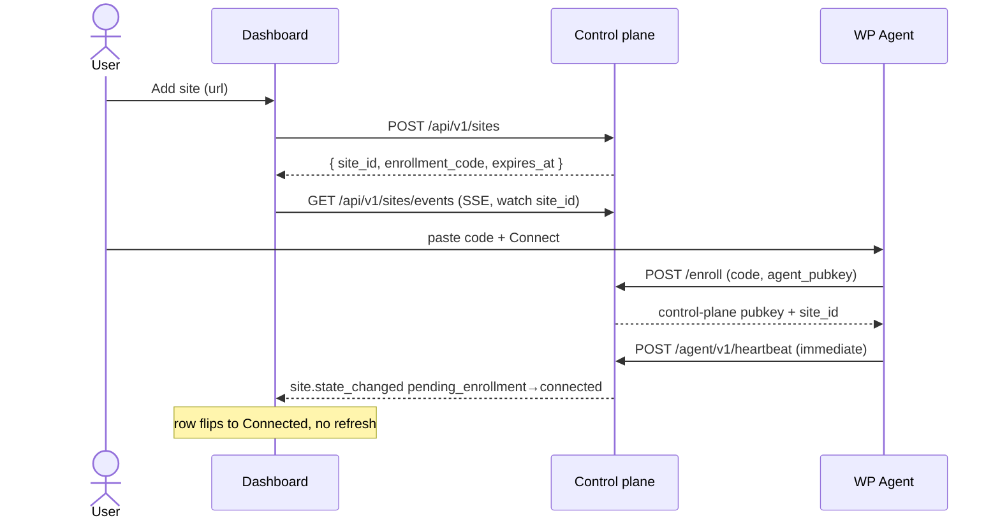

# Site connection lifecycle

Every managed site carries one **connection state** — the single source of truth
for whether an agent is enrolled, healthy, or gone. State changes stream live to
the dashboard over SSE, so the sites list and the Add-site modal update in place
with no refresh.

Design: [ADR-038](../adr/ADR-038-sse-channel-scoping.md) (SSE bus),
[ADR-039](../adr/ADR-039-heartbeat-cadence-timeouts.md) (heartbeat + timeouts),
[ADR-040](../adr/ADR-040-agent-last-will-disconnect.md) (last-will + signed
revoke), [ADR-041](../adr/ADR-041-reenrollment-identity-connection-state.md)
(state machine + re-enrollment).

## States

| State | Meaning |
|-------|---------|
| `pending_enrollment` | A site row + enrollment code exist; no agent has paired yet. "Awaiting agent." |
| `connected` | Agent enrolled, heartbeat fresh (≤180s). The healthy state. |
| `degraded` | Heartbeat missed ≥180s and <360s. Probably transient (low traffic / a skipped wp-cron tick), not yet down. |
| `disconnected` | Heartbeat missed ≥360s, or the agent posted a last-will (deactivate/uninstall). |
| `revoked` | An operator disconnected the site from the dashboard. The agent is told to wipe its keys + self-deactivate on its next beat. |
| `archived` | Terminal soft-delete. Hidden from the default list; history preserved. |

`connected` ⇄ `degraded` ⇄ `disconnected` are driven automatically by heartbeat
freshness. `revoked` and `archived` are explicit operator actions. The full
transition table is the Mermaid state diagram in
[architecture.md](../architecture.md#connection-state-machine).

## Enroll a site (live)

1. **Add site** → enter the site URL (and optional name/tags). The control plane
   creates the row in `pending_enrollment` and returns a one-time
   **enrollment code**.
2. The modal shows the code and flips to **Awaiting agent** — it has already
   subscribed to the lifecycle event stream for this `site_id`.
3. In **WP Admin → WPMgr**, paste the code and your control-plane URL, then
   **Connect**. The plugin generates its Ed25519 keypair and enrolls.
4. On a successful enroll the agent fires **one heartbeat synchronously** (it
   does not wait for the first 60s tick), so the dashboard transitions
   `pending_enrollment → connected` within ~1s. The modal flips to **Connected
   automatically — no refresh.**



**Code expiry.** Enrollment codes are single-use and expire **15 minutes** after
they are minted. The modal shows a live countdown. If it expires before you
paste it, click **Request new code** — this mints a fresh code bound to the same
`site_id` (it does not create a duplicate site).

## Disconnect from the dashboard (revoke)

**Sites → … → Disconnect** revokes the agent connection from the control-plane
side:

- The site transitions to `revoked` immediately; the row updates live.
- The control plane queues a `revoke` instruction. On the agent's **next
  heartbeat (≤60s)** the response carries that instruction plus a **signed
  revoke token**. The agent verifies the token (see below), then wipes its key
  material and **self-deactivates** the plugin.
- **History is preserved** — revoke is not a delete. The site stays in the list
  (filterable) and its connection history is intact, so you can re-enroll later.

> **Undo (60s).** Immediately after revoking, the dashboard offers a 60-second
> Undo. Because the agent only acts on the revoke on its next beat (≤60s), an
> Undo within that window puts the connection back before the agent has torn
> itself down.

The revoke token is a short-lived Ed25519 JWT (`cmd="revoke"`, `aud=<site_id>`)
minted by the control plane. The agent **fails closed**: a missing, forged,
expired, replayed, or wrong-audience token is ignored and **no teardown happens**
— TLS-only trust is not enough to trigger a destructive self-deactivation. See
[ADR-040 addendum](../adr/ADR-040-agent-last-will-disconnect.md#addendum-2026-05-31---signed-revoke-instruction-phase-6-security-review).

## Disconnect from the WP side

When the agent is removed at the WordPress end, the control plane learns one of
two ways:

- **Deactivate or uninstall (clean).** WordPress fires the deactivation /
  uninstall hook; the agent posts a **signed last-will** disconnect
  (best-effort, 3s budget). The dashboard shows `disconnected` **within
  seconds**. Uninstall additionally wipes the agent's stored keys and options.
- **Hard delete / dead host.** A manual `rm -rf` of the plugin, a crashed host,
  or a network blip fires nothing. The heartbeat-timeout sweeper is the safety
  net: the site falls to `degraded` after ≤180s and `disconnected` after
  **≤360s (≤6 min)**.

Neither path archives the site — archive stays an explicit operator action so
history is never silently hidden.

## Reconnect / re-enroll

**Reconnect** (on a `disconnected`, `revoked`, or `archived` site) begins
re-enrollment: it mints a fresh enrollment code **bound to the same `site_id`**
and moves the site back to `pending_enrollment`. Pairing the agent against that
code transitions it to `connected` again.

Re-enrollment **preserves identity and history** — the same `site_id` means
backups, scans, uptime, and the full connection history thread across
generations. Each re-enroll **increments `connection_generation`**, so prior
generations (e.g. "Generation 1 · 2026-01 → 2026-04") remain renderable from
history.

## Archive / Restore

- **Archive** — terminal soft-delete. The site is hidden from the default sites
  list; reach it via the `state:archived` filter chip. History is preserved.
- **Restore** — un-archives the site back to `disconnected`. From there,
  **Reconnect** to re-enroll an agent.

## Troubleshooting

**Site stuck on "Awaiting agent" (`pending_enrollment`).**
The agent has not enrolled yet, or the code expired. Confirm the plugin is
activated, that the control-plane URL in WP Admin matches your dashboard, and
that the site can reach the control plane outbound. If the code's 15-minute
window lapsed, click **Request new code** and paste the fresh one.

**Site shows `degraded` or `disconnected` but the site is actually healthy.**
This almost always means **WP-Cron is not firing**. The agent heartbeats on a
60s WP-Cron schedule, and WP-Cron only runs when the site receives traffic. A
low-traffic site can legitimately go minutes between page loads, so the timeout
sweeper marks it `degraded` (≥180s) then `disconnected` (≥360s) even though
nothing is wrong.

Fix it by driving wp-cron from the system crontab instead of relying on traffic:

```cron
* * * * * curl -s 'https://your-site.example/wp-cron.php?doing_wp_cron' >/dev/null 2>&1
```

(Optionally also set `define('DISABLE_WP_CRON', true);` in `wp-config.php` so
WP-Cron is driven *only* by the system cron above.) See
[agent.md → Heartbeat & connection lifecycle](../agent.md#heartbeat--connection-lifecycle).

**I revoked a site but the agent is still running locally.**
The agent acts on a revoke on its **next heartbeat (≤60s)**, not instantly. On a
no-traffic site (no wp-cron) the beat may be delayed — drive wp-cron from system
cron as above, or remove the plugin manually. The agent also **only** tears down
when the signed revoke token verifies; if your control plane has no signing key
configured, the revoke instruction is sent unsigned and the agent ignores it
(fail-closed).

**The dashboard missed a state change during a network blip.**
The event stream replays missed events on reconnect (`?since=<event_id>`, ~5 min
window) and reconciles the sites list on every connect, so short gaps self-heal.
A gap longer than the replay window resolves on the next list render.
